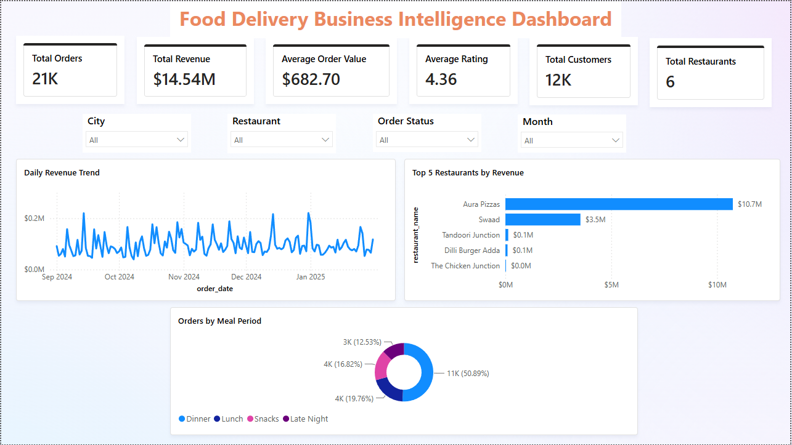
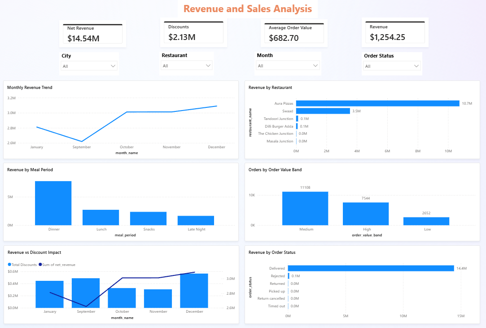
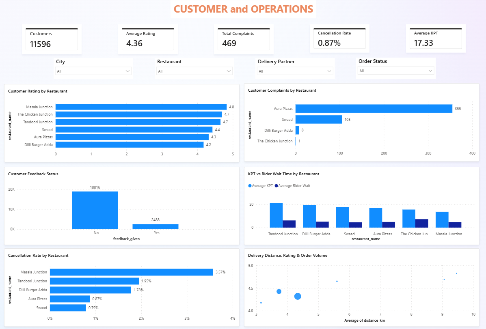
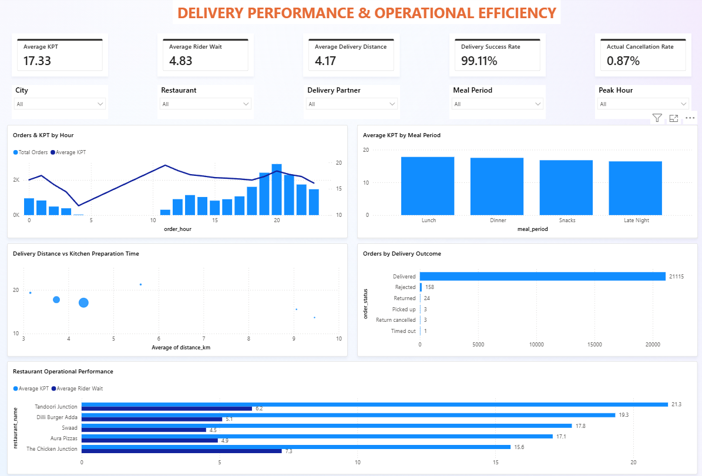
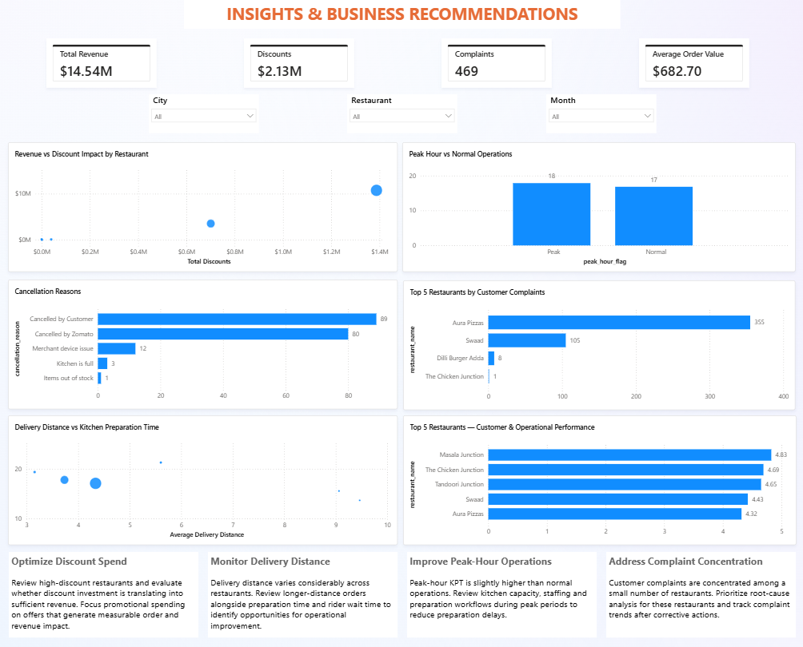

# 🍔 QuickBite Food Delivery Business Intelligence Platform

An end-to-end Business Intelligence and Analytics project designed to analyze food delivery operations, revenue performance, customer behavior, restaurant performance, discounts, complaints and delivery efficiency.

The project follows a structured data pipeline from raw order history through data cleaning, SQL-based transformation and validation to an interactive Power BI dashboard.

---

## 📌 Project Overview

QuickBite is a fictional food delivery business operating across restaurants and customers.

The objective of this project is to transform raw food delivery order data into actionable business insights that can help stakeholders understand:

- Revenue and sales performance
- Restaurant performance
- Customer behavior
- Customer complaints
- Order patterns
- Discount impact
- Delivery efficiency
- Kitchen preparation performance
- Cancellation patterns
- Peak-hour operational performance

The final solution provides a five-page Power BI dashboard supported by SQL-based data preparation and validation.

---

## 🎯 Business Objectives

The project focuses on answering key business questions:

1. How is revenue changing over time?
2. Which restaurants generate the highest revenue?
3. Which meal periods generate the most orders and revenue?
4. How effective are discounts in driving revenue?
5. Which restaurants receive the most customer complaints?
6. How does kitchen preparation time vary across restaurants?
7. How does peak-hour demand affect operational performance?
8. What are the major cancellation reasons?
9. How does delivery distance relate to operational performance?
10. Which restaurants require operational attention?

---

## 🏗️ Solution Architecture

```text
                Raw Food Delivery Dataset
                         │
                         ▼
                  Excel / CSV Data
                         │
                         ▼
              MySQL - Raw Layer
              order_history_raw
                         │
                         ▼
                Data Cleaning &
                 Transformation
                         │
                         ▼
             MySQL - Silver Layer
            order_history_clean
                         │
                         ▼
              Business SQL Queries
                    / Gold Layer
                         │
                         ▼
                    CSV Export
                         │
                         ▼
                   Power BI
                         │
                         ▼
             Interactive Dashboard
                         │
                         ▼
             Business Insights
             & Recommendations

```
---

## 📊 Power BI Dashboard Preview

### 1. Executive Overview


### 2. Revenue & Sales Analysis


### 3. Customer & Operations


### 4. Delivery Performance


### 5. Business Insights & Recommendations


---
## 🔍 Key Business Insights

- **Revenue Performance:** Aura Pizzas contributes the largest share of revenue, followed by Swaad, highlighting the concentration of sales among the leading restaurants.
- **Customer Feedback:** Customer complaints are concentrated primarily in Aura Pizzas and Swaad, indicating areas for targeted service-quality improvement.
- **Operational Efficiency:** Kitchen preparation time varies across restaurants, with peak-hour preparation taking slightly longer than during normal hours.
- **Discount Impact:** Discount spending varies considerably by restaurant. Evaluating discounts alongside revenue and order volume can help identify opportunities to improve promotional efficiency.
- **Delivery Performance:** Delivery distance varies across restaurants, and reviewing distance alongside kitchen preparation time and rider wait time can help identify operational improvement opportunities.
- **Order Outcomes:** The dataset shows a high delivery success rate, while cancellation reasons provide further opportunities to investigate order fulfilment issues.

*These insights are based on the analyzed dataset and are descriptive findings, not evidence of causal relationships.*

---

## 📚 Project Documentation

- [Data Dictionary](documentation/data_dictionary.md)
- [Data Pipeline](documentation/data_pipeline.md)
- [DAX Measures](documentation/dax_measures.md)
- [Data Quality Notes](documentation/data_quality_notes.md)
